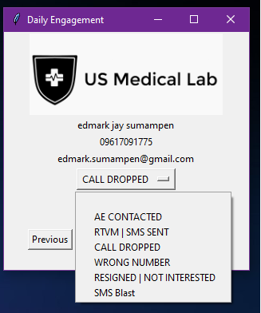

# Daily Engagement




Daily Engagement Contact Viewer is a GUI application that allows you to view and manage your contacts.


## Installation

To install Daily Engagement Contact Viewer, you will need to have Python 3 installed on your computer. You can download Python 3 from the [official website](https://www.python.org/downloads/).

Once you have Python 3 installed, you can install Contact Viewer by downloading the source code from this repository and running the following command in the directory where you downloaded the source code:

```bash
pip install -r requirements.txt
```

## Usage

To use Daily Engagement Contact Viewer, run the `daily_engagement.pyw` script with Python 3:

```bash
python3 daily_engagement.pyw
```


This will start the Daily Engagement Contact Viewer application. You can navigate through your contacts using the "Previous" and "Next" buttons. You can also jump to the first contact without a disposition by clicking the "Continue" button.

To update the disposition for a contact, select a disposition from the dropdown menu. Your changes will be saved automatically.

You can also copy the name, number, and email of a contact to your clipboard by clicking on their respective labels.

## License

Contact Viewer is released under the MIT License.

### 📕 Pls Support me for more future Projects..

<!-- BLOG-POST-LIST:START -->

---


<details>
  <summary>:zap: GitHub Stats</summary>

  

</details>
